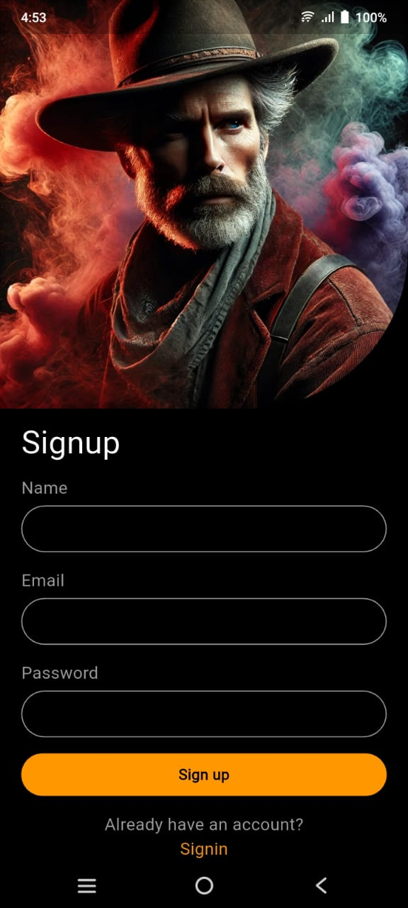
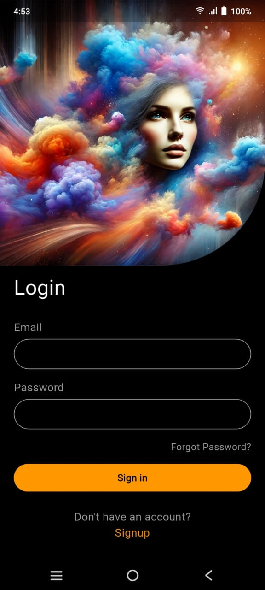
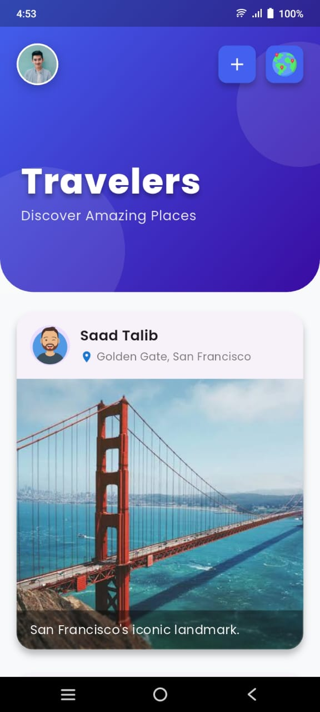
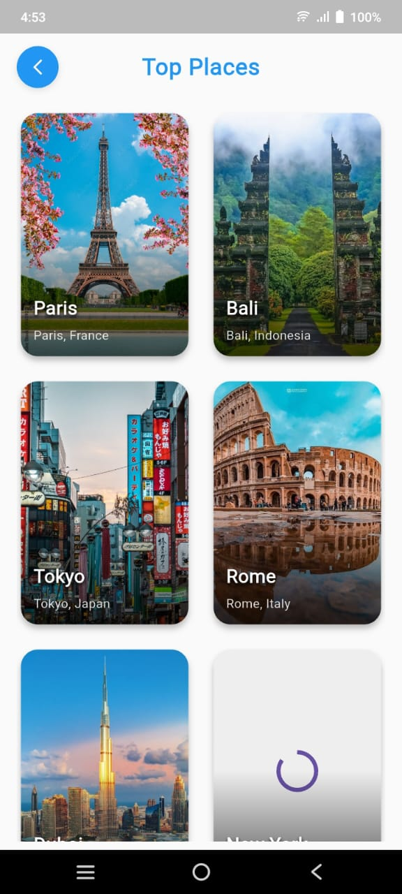
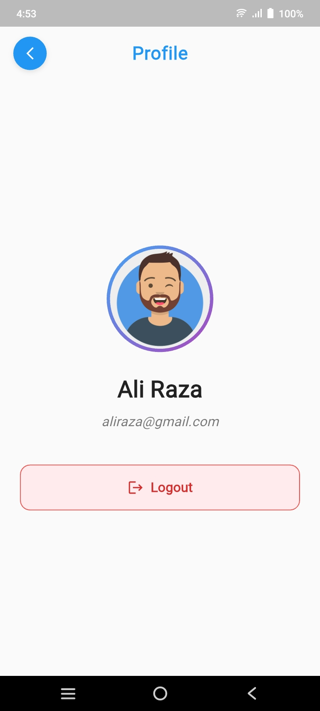
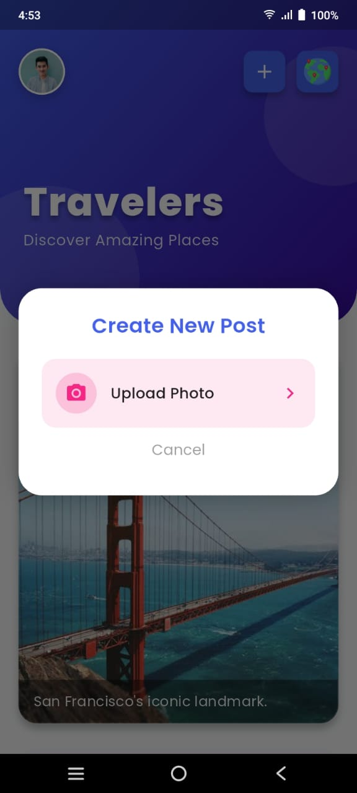
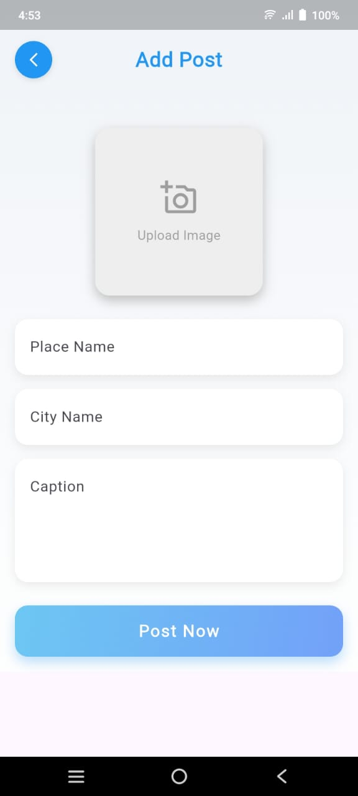

# ✈️ TravelBook - Explore & Book Your Next Adventure

A Flutter travel booking application where users can discover top destinations, share experiences, and plan their trips.


## 📱 App Screenshots

| Sign Up | Login | Home | Top Places |
|---------|-------|------|------------|
|  |  |  |  |

| Place Details | Profile | Create Post | Add Posts |
|---------------|---------|-------------|----------|
|  |  |  |  |

## ✨ Key Features

### 👤 User Management
- Secure signup/login with email/password
- User profile management
- Logout functionality
- Password reset option

### 🌍 Travel Features
- Browse top travel destinations
- View detailed place descriptions
- Save favorite places
- Create and share travel posts
- View other users' travel experiences

## 🛠️ Tech Stack

**Frontend**:
- Flutter (Cross-platform framework)
- Provider (State management)
- Cached Network Image (Image loading)
- Google Maps (Optional for locations)

**Backend**:
- Firebase Authentication
- Cloud Firestore (Database)
- Firebase Storage (Image uploads)
- Google Places API (Optional for places data)

## 🚀 Getting Started

### Prerequisites
- Flutter SDK (3.19.0 or newer)
- Firebase project setup
- Google Maps API key (optional)

### Installation
```bash
# Clone the repository
git clone https://github.com/yourusername/TravelBook.git
cd TravelBook

# Install dependencies
flutter pub get

# Set up Firebase:
1. Add your configuration files:
   - Android: `android/app/google-services.json`
   - iOS: `ios/Runner/GoogleService-Info.plist`
2. Enable Email/Password auth in Firebase Console

# Run the app
flutter run